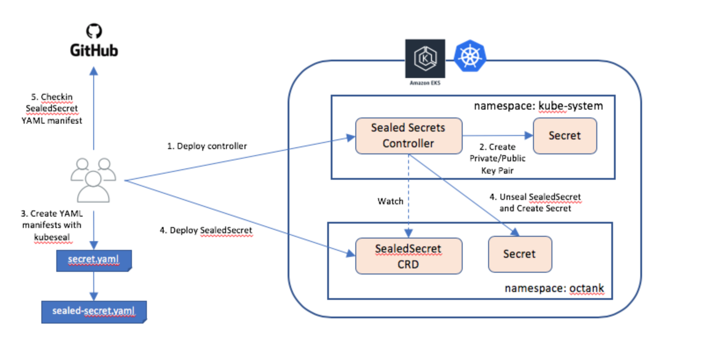

## Continuous delivery using GitOps
GitOps is a term coined by WeaveWorks and is a way to do Kubernetes cluster management and continuous delivery. 
In this approach, a Git repository is designated as the single source of truth for deployment artifacts, such as YAML files, that provide a declarative way to describe the cluster state. As illustrated in the architecture below, a Weave Flux agent runs in the Kubernetes cluster and watches the Git repository and image registries, such as Amazon Elastic Container Registry (Amazon ECR) and Docker Hub, where the container images pertaining to application workloads reside. If changes to deployment artifacts are pushed to this config repository or a new image is pushed to the image registry by a continuous integration system such as Jenkins, the Weave Flux agent responds by pulling these changes down and updating the relevant applications workloads deployed to the cluster.
 
## The challenge with handling Secrets

A Kubernetes cluster has different types of resources such as Deployments, DaemonSets, ConfigMaps, Secrets, etc. A Secret is a resource that helps cluster operators manage the deployment of sensitive information, such as passwords, OAuth tokens, and SSH keys. These Secrets can be mounted as data volumes or exposed as environment variables to the containers in a Kubernetes Pod, thus decoupling Pod deployment from managing sensitive data needed by the containerized applications within a Pod.

The challenge here is with integrating these Secrets into the GitOps workflow by storing the relevant YAML manifests outside the cluster, in a Git repository. The data in a Secret is obfuscated by using merely Base64 encoding. Storing such files in a Git repository is extremely insecure as it is trivial to decode the Base64-encoded data. Often developers accidentally check these files into their Git repositories, thus exposing sensitive information—such as credentials—to their production databases.

Sealed Secrets open source project addresses this challenge by providing a mechanism to encrypt a Secret object so that it is safe to store in a private or public repository. These encrypted Secrets can also be deployed to a Kubernetes cluster using normal workflows with tools such as kubectl.

## A list of secret management solutions
1. Bitnami Sealed Secrets
2. GoDaddy Kubernetes External Secrets
3. External Secrets Operator
4. Hashicorp Vault
5. Banzai Cloud Bank-Vaults
6. Helm Secrets
7. Kustomize secret generator plugins
8. aws-secret-operator
9. KSOPS 

## Bitnami Sealed Secrets 

This tutorial will use [bitnami sealed secret](https://github.com/bitnami-labs/sealed-secrets "sealed secret ")

## How it works

1. A controller deployed to cluster
2. A CLI tool called kubeseal
3. A customer resource definition (CRD) called SealedSecret

Upon startup, the controller looks for a cluster-wide private/public key pair, and generates a new 4096-bit RSA key pair if not found. The private key is persisted in a Secret object in the same namespace as that of the controller. The public key portion of this is made publicly available to anyone wanting to use Sealed Secrets with this cluster.

During encryption, each value in the original Secret is symmetrically encrypted using AES-256 with a randomly generated session key. The session key is then asymmetrically encrypted with the controller’s public key using SHA256 and the original Secret’s namespace/name as the input parameter. The output of the encryption process is a string that is constructed as: length (2 bytes) of encrypted session key + encrypted session key + encrypted Secret.

When a SealedSecret custom resource is deployed to the Kubernetes cluster, the controller will pick it up, unseal it using the private key, and create a Secret resource. During decryption, the SealedSecret’s namespace/name is used again as the input parameter. This ensures that the SealedSecret and Secret are strictly tied to the same namespace and name.

The companion CLI tool kubeseal is used for creating a SealedSecret custom resource definition (CRD) from a Secret resource definition using the public key. kubeseal can communicate with the controller through the Kubernetes API server and retrieve the public key needed for encrypting a Secret at runtime. The public key may also be downloaded from the controller and saved locally to be used offline.
